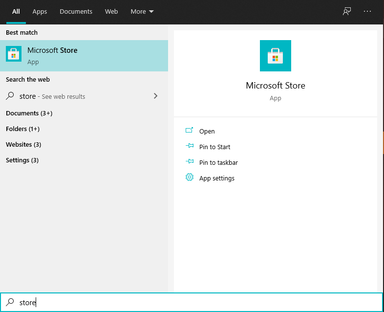
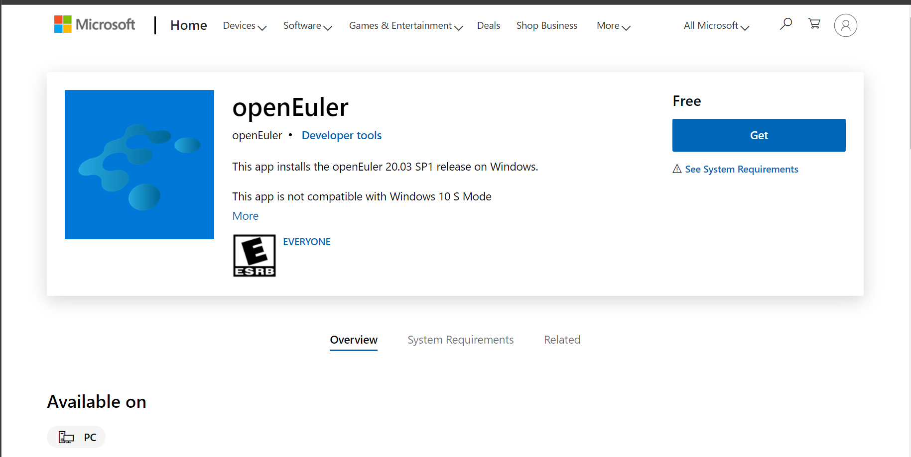

# How to Run openEuler on WSL

Configure the WSL environment in 5 steps, and then you can install any WSL distribution from the Microsoft Store, including openEuler!

# Configure the WSL Environment

Official documents are available at: [Install WSL on Windows 10 | Microsoft Docs](https://docs.microsoft.com/en-us/windows/wsl/install-win10). You can also follow these steps:  

## 1 Run PowerShell

To start Poweshell as an administrator, you can press **Win+X** and click **Windows PowerShell (Administrator)**.  

Do not click **Windows PowerShell**. Do click the one with the **administrator** suffix.  

Copy and paste the following commands into the console and press **Enter** to run:  

## 2 Enable the Windows Subsystem for Linux

```powershell
dism.exe /online /enable-feature /featurename:Microsoft-Windows-Subsystem-Linux /all /norestart
```

## 3 Enable the Virtual Machine Feature

```shell
dism.exe /online /enable-feature /featurename:VirtualMachinePlatform /all /norestart
```

## 4 Reboot Your Computer

Reboot your computer so you can proceed to the subsequent operations.  

You can add the document page in your browser favorites. That allows you to easily find this document after the reboot.  

## 5  Download the Linux Kernel Upgrade Package

Download the [latest package](https://wslstorestorage.blob.core.windows.net/wslblob/wsl_update_x64.msi). Double-click it to start the installation. When you are prompted for an elevated permission, select **yes** to continue the installation.  

## 6 Set WSL 2 as Your Default Version

Start PowerShell and run this command to set WSL 2 as the default version when installing a new Linux distribution:  

```shell
wsl --set-default-version 2
```

# Install openEuler

Once you have completed the preceding operations, you can go to the Microsoft Store and install any Linux distribution, like openEuler.  

Click [openEuler in Microsoft Store](https://www.microsoft.com/en-us/p/openeuler/9ngf0q0xp03d?rtc=1&activetab=pivot:overviewtab), click **Get**, and accept jumping to Microsoft Store.  

Alternatively, open the Microsoft Store manually and search for **openEuler**, as shown below:  

By default, your taskbar should have the following icons:  


If not, you can press **Win+Q** and search for Microsoft Store.  



In either way, you will see the openEuler description page on the Microsoft Store, as shown below. click **Get** and wait for the installation.  



# Launch openEuler

Launch openEuler in any of the following methods:  
