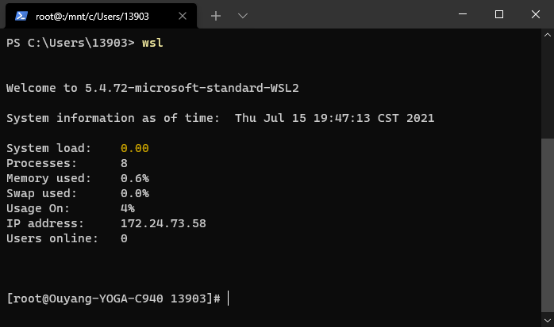
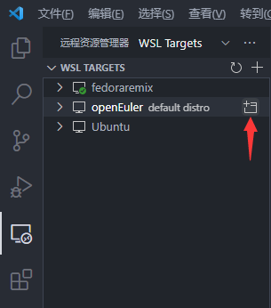

# How to Run openEuler on WSL

First you need to configure the WSL environment in 5 steps, and then you can install any WSL distribution from the Microsoft Store, including openEuler!

# Configure the WSL Environment

Official documents are available at: [Install WSL on Windows 10 | Microsoft Docs](https://docs.microsoft.com/en-us/windows/wsl/install-win10). You can also follow these steps.

## 1 Run PowerShell

To open Poweshell as an administrator, you can press  **Win+X**  and click **Windows PowerShell (Administrator)**.

Do not click **Windows PowerShell**. Do click the one with the **administrator** suffix.

Copy and paste the following commands into the console and press **Enter** to run:

## 2 Enable the Windows subsystem for Linux

```powershell
dism.exe /online /enable-feature /featurename:Microsoft-Windows-Subsystem-Linux /all /norestart
```

## 3 Enable the virtual machine feature

```shell
dism.exe /online /enable-feature /featurename:VirtualMachinePlatform /all /norestart
```

## 4 Reboot your computer 

Reboot your computer so you can proceed to the subsequent operations.

You can add the document page in your browser favorites. That allows you to easily find this document after the reboot.

## 5  Download the Linux kernel update package

Download the [latest package](https://wslstorestorage.blob.core.windows.net/wslblob/wsl_update_x64.msi). Double-click it to start the installation. When you are prompted for an elevated permission, select **yes** to continue the installation.

## 6 Set WSL 2 as your default version

Open PowerShell and run this command to set WSL 2 as the default version when installing a new Linux distribution:

```shell
wsl --set-default-version 2
```

# Install openEuler

Once you have completed the preceding operations, you can go to the Microsoft Store and install any Linux distribution, like openEuler.

Click [openEuler in Microsoft Store](https://www.microsoft.com/store/apps/9NGF0Q0XP03D), click  **Get** , accept jumping to Microsoft Store.

Alternatively, open the Microsoft Store manually and search for **openEuler**, as shown below:

By default, your taskbar should have the following ICONS:


If not, you can press Win+Q and search for Microsoft Store.


In either way, you will see the openEuler description page on the Microsoft Store, as shown below. click **Get** and wait for the installation.


# Launch openEuler

Launch openEuler in any of the following methods:

1. Click the icon in the  **Start**  menu.
2. Launch from a command line.
3. Launch from VS Code.

## Click the icon in the  **Start**  menu


As shown in the figure, drag the small openEuler icon on the left to the right to become a larger tile. Click either the tile or the small icon to run.

## Launch from a command line

There are three command lines on Windows: Poweshell, cmd, and Windows Terminal.

Windows Terminal is recommended, which is more in line with the habits of Linux and has a more beautiful interface.

The following shows you how to install Windows Terminal and how to use it.

1. Open Microsoft Store, search for Windows Terminal, and install it.
2. Open Windows Terminal in the  **Start**  menu or  press **Win+Q**  to search for Windows Terminal.
3. Or press  **Win+R** , type  **Windows Terminal**  or its abbreviation  **wt** , and then press  **Enter**  to launch.

After starting any of the three command lines above, you can start openEuler by typing the WSL command on the command line.

Enter the following commands to get command line help:

```
wsl -h
```

Enter the following command to display the currently installed WSL distribution:

```
wsl -l
```


You can see that openEuler fedoraremix Ubuntu is installed here, and openEuler is the default distribution.

To start the default distribution, enter the following command:

```
wsl 
```

If you installed another WSL distribution before openEuler, you can run the following command to set openEuler to be the default distribution.

```
wsl -s openEuler
```

In addition, you can specify to start any distribution using the  **-d**  command.

```
wsl -d openEuler
```



As shown in the figure above, Windows Terminal is used to launch the default distribution of WSL, which is openEuler.


## Launch from VS Code

If you want to write some code, VS Code is recommended to open WSL.

VS Code can use SSH to connect to WSL. It needs to download an installation package in the WSL, which needs to be unpacked using tar. Therefore, the WSL distribution requires installing tar. 

1. Using the method described above, open openEuler from a command line and install tar.

   ```
   dnf install tar -y
   ```

2. Install VS Code: [Visual Studio Code - Code Editing. Redefined](https://code.visualstudio.com/).

3. Open VS Code and install the WSL plug-in.


2. In the Remote Explorer, click the drop-down button and select  **WSL Targets**. 


3. In the menu, select  **openEuler**  to open a new window to start openEuler.

   

4. In VS Code, press  **Ctrl+~**  to open the console.

# Startup Interface

An installation is required for the first running. Wait one or two minutes, as shown in the figure below:


After the installation is complete, the screen information is as follows:


# Notes

## WSL is not compatible with VMware VirtualBox

Refer to [FAQ's about Windows Subsystem for Linux 2 | Microsoft Docs](https://docs.microsoft.com/en-us/windows/wsl/wsl2-faq#will-i-be-able-to-run-wsl-2-and-other-3rd-party-virtualization-tools-such-as-vmware--or-virtualbox-). WSL uses Hyper-V technology to provide virtualization, and some earlier versions of VMware and VirtualBox do not work properly when Hyper-V technology is enabled.

This means that you need to update VMware and VirtualBox to the new version to fix the problem.

## VS Code failed to connect to openEuler

If you use VS Code to connect to openEuler and see an error like the one shown in the image below, you will need to install tar in openEuler for VS Code to connect.

Start openEuler from the command line, and then run the following command to install the tar package:

```shell
dnf install tar -y
```


## Other problems

If you encounter other problems during the installation process, please refer to the following Microsoft documentation:

1. [Install WSL on Windows 10 | Microsoft Docs](https://docs.microsoft.com/en-us/windows/wsl/install-win10#troubleshooting-installation)
2. [Troubleshooting Windows Subsystem for Linux | Microsoft Docs](https://docs.microsoft.com/en-us/windows/wsl/troubleshooting)

In addition, Microsoft also introduces more useful knowledge about WSL:

[Windows Subsystem for Linux Documentation | Microsoft Docs](https://docs.microsoft.com/en-us/windows/wsl/)

## The defect of WSL  

WSL has some unsupported native Linux features, such as systemctl and GUI.

Please refer to [FAQ's about Windows Subsystem for Linux 2 | Microsoft Docs](https://docs.microsoft.com/en-us/windows/wsl/wsl2-faq). 

# Porting Process

If you are interested in the porting process, please refer to [porting process](./porting process.md).

